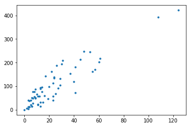
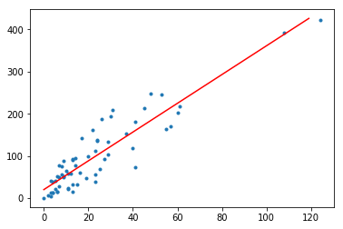
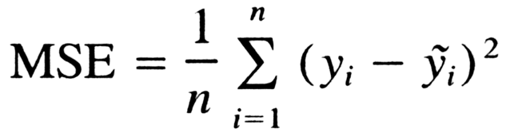
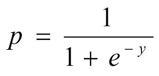
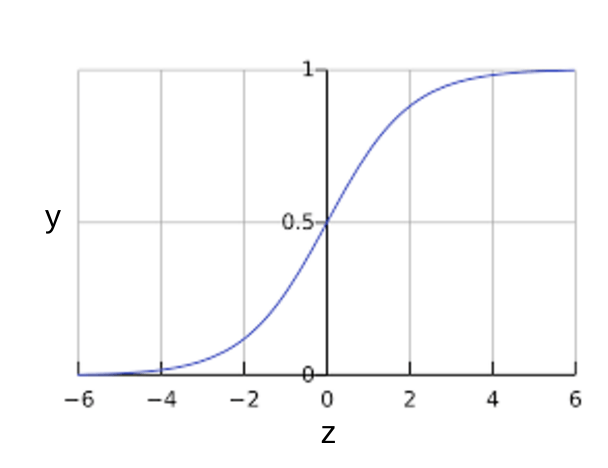
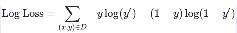
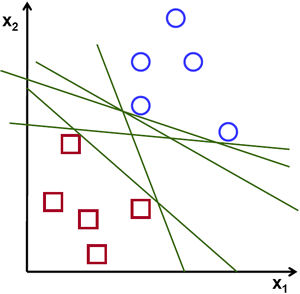
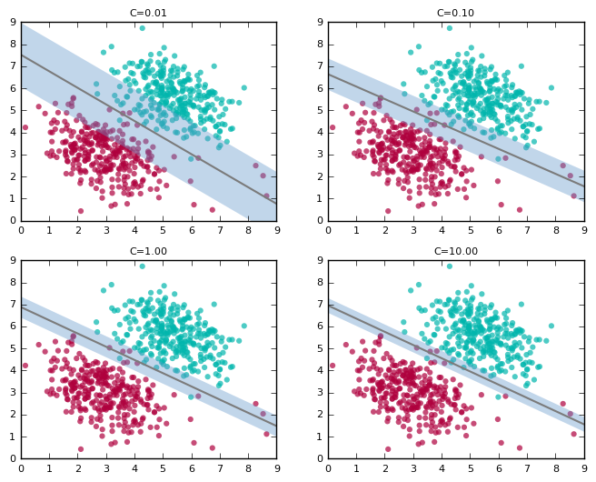
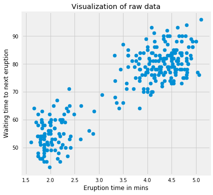
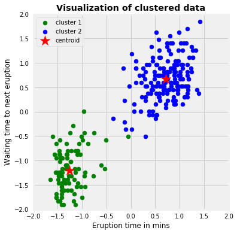

# Hands-on session.

## Linear Regression

Linear regression is a method for finding the straight line or hyperplane that best fits a set of points.

The line equation is,

> `y = mx + b` 

In machine learning we use this convention instead,

> `y' = b + w1x1`

Where,
**y'** is the label we are predicting.
**b** is the bias.(does the same thing what a constant c does to the line equation.Determines if to pass through origin or not)
**w1** is the weight of feature 1. Weight is the same concept as the "slope" in the traditional equation of a line.
**x1** is a feature (the input).

To predict, just substitute the x1 values to the trained model.

A sophisticated model can use more than one features.

> `y' = b + w1x1 + w2x2 + w3x3 + .... + wNxN`
> here, x1,x2,x3 are the different different features which predict for the label.

Cost function for Linear regression is Mean Squared Error.(Also known as L2 Loss.)

### Reducing Loss
Reducing the loss is similar to the **"Hot and cold game"** kids play!(Hot if youre nearer,cold if youre not.)

A Machine Learning model is trained by starting with an initial guess for the weights and bias and iteratively adjusting those guesses until learning the weights and bias with the lowest possible loss.

* Gradient Descent
Gradient Descent is a general function for minimizing a function, in this case the Mean Squared Error cost function.

  

To explain it very briefly, it is a way to determine how well the machine learning model has performed given the different values of each parameters.
Gradient descent is an optimization algorithm used to minimize some function by iteratively moving in the direction of steepest descent as defined by the negative of the gradient. In machine learning, we use gradient descent to update the parameters of our model. Parameters refer to coefficients in Linear Regression and weights in neural networks.
In the above figure, we must reach the steepest point,i.e, the bottom most point here,which is the local minimum. We have to converge to that value, and then we can say, with minimum loss, we can predict the output.

* Learning Rate

  

We take steps in gradient descent to converge to the local minimum. But learning rate also shouldnt be to high or too low, which result in values other than local minimum.

Let's try implementing [Linear Regression in Scikit Learn.](https://colab.research.google.com/drive/1dbJr3bqCK8PIeavB0jHYWU0xZpkLm5Zj)

## Logistic Regression

Many problems require a probability estimate as output and here comes Logistic Regression.
* Logistic regression is an extremely efficient mechanism for calculating probabilities.

For example, consider that the probability of coconut falling on someone's head while walking through a field is 0.05. Then over the year, 18 accidents will happen in that field because of coconut!

> ``P(thenga|day) = 0.05
> coconut falling on head =
> 0.05*365 
> ~= 18``

A Sigmoid function, defined as follows, produces output that always falls between 0 and 1. So,the aim of logistic regression is to get a probabilistic value between 0 and 1, and you can see that in the graph

Sigmoid function

Where,
> `y = w1x1 + w2x2 + ... wNxN`
> `and p is the predicted output.`

Loss function for Logistic regression is Log Loss

Try doing [Logistic Regression using Scikit Learn](https://colab.research.google.com/drive/1tVqHkJVS6bNmCVPKRtk5FwWLYdoM85Ww)

## Support Vector Machine
The objective of the support vector machine algorithm is to find a hyperplane in an N-dimensional space(N — the number of features) that distinctly classifies the data points.
To separate the two classes of data points, there are many possible hyperplanes that could be chosen.
Our objective is to find a plane that has the maximum margin, i.e the maximum distance between data points of both classes.
Maximizing the margin distance provides some reinforcement so that future data points can be classified with more confidence.

the C

Read more about SVM [here](https://towardsdatascience.com/support-vector-machine-introduction-to-machine-learning-algorithms-934a444fca47)

[SVM Implementation](https://colab.research.google.com/drive/1ul3nDq97a1fT0Li6aClV-_iVB9pursSz)

## k-Means Clustering

Kmeans algorithm is an iterative algorithm that tries to partition the dataset into Kpre-defined distinct non-overlapping subgroups (clusters) where each data point belongs to only one group. It tries to make the inter-cluster data points as similar as possible while also keeping the clusters as different (far) as possible. The approach kmeans follows to solve the problem is called Expectation-Maximization.

Read more about k-Means [here](https://towardsdatascience.com/k-means-clustering-algorithm-applications-evaluation-methods-and-drawbacks-aa03e644b48a)

Let's try [implementing k-Means](https://colab.research.google.com/drive/1bxaLyMwmsHgoUjNwYB2ftHkTWklQPI52)

## Some other important Algorithms.
* **[Naive Bayes Classifier](https://towardsdatascience.com/naive-bayes-classifier-81d512f50a7c)**
* **[Decision Tree](https://towardsdatascience.com/decision-trees-in-machine-learning-641b9c4e8052)**
* **[K-Nearest Neighbors](https://towardsdatascience.com/machine-learning-basics-with-the-k-nearest-neighbors-algorithm-6a6e71d01761)**
* **[Random Forest](https://towardsdatascience.com/understanding-random-forest-58381e0602d2)**

## Project : Let's Move on to something more real.
Try Solving [California Housing Price Prediction..](https://www.kaggle.com/camnugent/california-housing-prices)
Do as in [this notebook](https://colab.research.google.com/drive/1Pea-fn96TO18MsjRHC87C0fICy7Wx8XG)

[.](https://www.kaggle.com/gokuldas027/housing-price-prediction-with-linear-regression)
[.](https://colab.research.google.com/drive/1YeLRjVigxw3QJSNJejItGxLynX7MDNw9)
