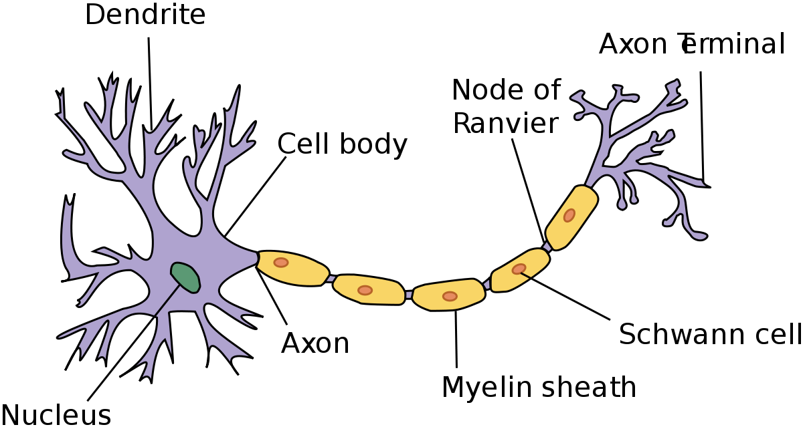
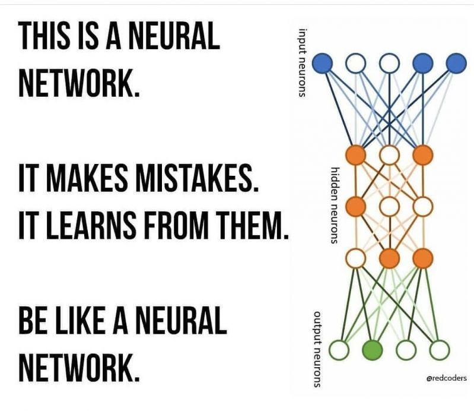
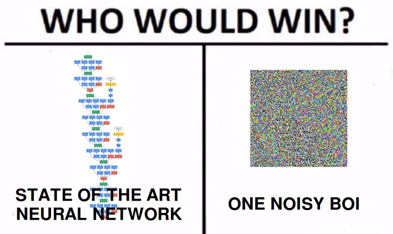

okay, now let's move on to 
# Neural Networks
### Deep Learning is a superpower. With it you can make a computer see, synthesize novel art, translate languages, render a medical diagnosis, or build pieces of a car that can drive itself. If that isn’t a superpower, I don’t know what is.
— Andrew Ng, Founder of deeplearning.ai and Coursera

**Neurons In brain**
Cells within the nervous system, called neurons, communicate with each other in unique ways. The neuron is the basic working unit of the brain, a specialized cell designed to transmit information to other nerve cells, muscle, or gland cells.
    
The brain is what it is because of the structural and functional properties of interconnected neurons. The mammalian brain contains between 100 million and 100 billion neurons, depending on the species.

 
 
Theres a difference between machine learning and deep learning
 Machine learning is a lot of complex math and coding that, at the end of day, serves a mechanical function the same way a flashlight, a car, or a television does. When something is capable of “machine learning”, it means it’s performing a function with the data given to it, and gets progressively better at that function. It’s like if you had a flashlight that turned on whenever you said “it’s dark”, so it would recognize different phrases containing the word “dark”.

Deep learning
In practical terms, deep learning is just a subset of machine learning.
  Let’s go back to the flashlight example: it could be programmed to turn on when it recognizes the audible cue of someone saying the word “dark”. Eventually, it could pick up any phrase containing that word. Now if the flashlight had a deep learning model, it could maybe figure out that it should turn on with the cues “I can’t see” or “the light switch won’t work”. A deep learning model is able to learn through its own method of computing – its own “brain”, if you will.
### So,any clue as to why I explained about a neuron earlier?
 
 
Neural Networks and perceptrons
Perceptron is a single layer neural network and a multi-layer perceptron is called Neural Networks.
Perceptron is a linear classifier (binary). Also, it is used in supervised learning
But how does it work?
The perceptron works on these simple steps

1. All the inputs x are multiplied with their weights w. Let’s call it k.

2 Add all the multiplied values and call them Weighted Sum.

3. Apply that weighted sum to the correct Activation Function.
   For Example : Unit Step Activation Function.
   

## Nightmare of DNN -Overfitting!!
 Overfitting is when the trained model memorizes the undesirable patterns or noise from the training data-set. This is due to too much training or learning capacity(too many hidden layers or neurons in each layer). The consequence of overfitting is that, model cannot generalize to samples outside its training set, which overall reduces the performance of the model. To determine whether the model is overfitting, during the training, compare the loss value on the training and testing set. If the loss on the test set is much larger than in the training set, then the model is overfitting, specially if the training loss is low. However, it is also normal that the test loss is slightly larger than training loss.

## Activation Functions
To model a nonlinear problem, we can directly introduce a nonlinearity. We can pipe each hidden layer node through a nonlinear function.

In the model represented by the following graph, the value of each node in Hidden Layer 1 is transformed by a nonlinear function before being passed on to the weighted sums of the next layer. This nonlinear function is called the activation function
https://developers.google.com/machine-learning/crash-course/introduction-to-neural-networks/anatomy

Here are some activation functions
1. ReLu -Rectified linear units
2. Sigmoid or Logistic
3. Tanh — Hyperbolic tangent

## Forward and Backward Propogation

**_In neural networks, you forward propagate to get the output and compare it with the real value to get the error._**

**_Now, to minimize the error, you propagate backwards by finding the derivative of error with respect to each weight and then subtracting this value from the weight value._**

The basic learning that has to be done in neural networks is training neurons when to get activated. Each neuron should activate only for particular type of inputs and not all inputs. Therefore, by propagating forward you see how well your neural network is behaving and find the error. After you find out that your network has error, you back propagate and use a form of gradient descent to update new values of weights. Then, you will again forward propagate to see how well those weights are performing and then will backward propagate to update the weights. This will go on until you reach some minima for error value.

## Training
What happens when you try to learn something for an examination? You dont exactly memorise everything as such, right?
You create a model inside your head, so that when a question is asked , you can answer accordingly using the model you have inside your head.

The training data must contain the correct answer, which is known as a target or target attribute. The learning algorithm finds patterns in the training data that map the input data attributes to the target (the answer that you want to predict), and it outputs an ML model that captures these patterns.

You can use the ML model to get predictions on new data for which you do not know the target. For example, let's say that you want to train an ML model to predict if an email is spam or not spam. You would provide the network with training data that contains emails for which you know the target (that is, a label that tells whether an email is spam or not spam). The network would train an ML model by using this data, resulting in a model that attempts to predict whether new email will be spam or not spam.

## Problems with Neural Network

1. Adversarial Attacks

