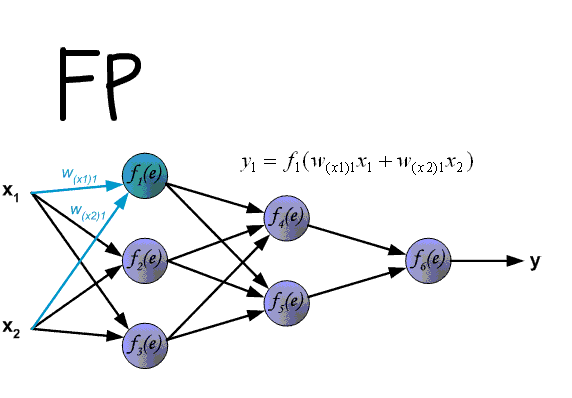
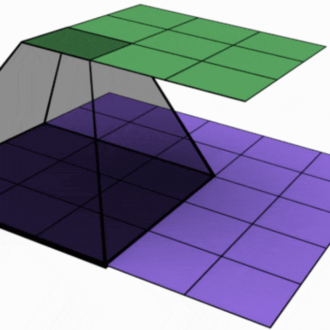

okay, now let's move on to 
# Artificial Neural Networks

### Deep Learning is a superpower. With it you can make a computer see, synthesize novel art, translate languages, render a medical diagnosis, or build pieces of a car that can drive itself. If that isn’t a superpower, I don’t know what is.
— **Andrew Ng**, Founder of deeplearning.ai and Coursera

## ANN Evolution.

### Neurons In brain
Cells within the nervous system, called neurons, communicate with each other in unique ways. The neuron is the basic working unit of the brain, a specialized cell designed to transmit information to other nerve cells, muscle, or gland cells.   
The brain is what it is because of the structural and functional properties of interconnected neurons. The mammalian brain contains between 100 million and 100 billion neurons, depending on the species.


### Artificial Neural Networks
Artificial neural networks (ANNs) or connectionist systems are computing systems inspired by the biological neural networks. Such systems learn (progressively improve their ability) to do tasks by considering examples, generally without task-specific programming. For example, in image recognition, they might learn to identify images that contain cats by analyzing example images that have been manually labeled as "cat" or "no cat" and using the analytic results to identify cats in other images. They have found most use in applications difficult to express with a traditional computer algorithm using rule-based programming.
An ANN is based on a collection of connected units called artificial neurons, (analogous to biological neurons in a biological brain). Each connection (synapse) between neurons can transmit a signal to another neuron. The receiving (postsynaptic) neuron can process the signal(s) and then signal downstream neurons connected to it. Neurons may have state, generally represented by real numbers, typically between 0 and 1. Neurons and synapses may also have a weight that varies as learning proceeds, which can increase or decrease the strength of the signal that it sends downstream.


[Difference between ANN and BNN](https://towardsdatascience.com/the-differences-between-artificial-and-biological-neural-networks-a8b46db828b7)
1. Size
2. Topology
3. Speed
4. Fault Tolerence
5. Power Consumption
6. Signals


### Single ANN Functionality


### ANN History
 
We from the begining itself believed that the best way to achieve AI is by mimicking the human brain. And thus ANNs started evolving since the 1950s.


Even after the discovery of Backpropagation, teaching these networks was so computationally expensive that people rarely used them for machine learning tasks. Most scientists still regarded them as dead ends in machine learning. But afterwards due to the increase in Data and Computation Resources it is live again.
The hype got back, when in 2012 a Deep Neural Network architecture AlexNet managed to solve the ImageNet challenge (a large visual dataset with over 14 million hand-annotated images) without relying on handcrafted, minutely extracted features that were the norm in computer vision up to this point. AlexNet beat its competition by miles, paving the way for neural networks to be once again relevant.

 
## Basic ANN Structure Explanation

 
 3 Types of Layers :
 1. Input Layer
 2. Hidden Layer
 3. Output Layer
 
## Artificial Neural Networks to Deep Neural Networks
A deep neural network (DNN) is an artificial neural network (ANN) with multiple layers between the input and output layers.
 
 
 
 
 
## Difference between Deep Neural Networks and other Supervised ML Algorithms

Neural Networks, as a subset of Machine Learning methods, both supervised and unsupervised, are non-deterministic classifiers (when we don't know the exact math model of the “brain” - ex.: why weights are distributing this way or that distribution, or why 5-layer NN works better than 4 or 6-layer ones in a particular case etc) for solving optimization problems. I mean here the absence of the exact math model (as in Linear Models) for the classifier, or lack of function in analytical form - not the heuristics and gradient descent as the method. 
 
## Neural Networks and perceptrons

**Frank Rosenblatt**, an American Psychologist proposed the basic Perceptron model in 1958, and it was a huge achievement of Deep Learning Research of that time. 

> ```“the embryo of an electronic computer that [the Navy] expects will be able to walk, talk, see, write, reproduce itself and be conscious of its existence.”``` -New York Times(1958)

> ```“the perceptron may eventually be able to learn, make decisions, and translate languages”``` - Frank Rosenblatt

Perceptron is a single layer neural network and a multi-layer perceptron is called Neural Networks.
Perceptron is a linear classifier (binary). Also, it is used in supervised learning.

The idea behind perceptrons (the predecessors to artificial neurons) is that it is possible to mimic certain parts of neurons, such as dendrites, cell bodies and axons using simplified mathematical models of what limited knowledge we have on their inner workings: signals can be received from dendrites, and sent down the axon once enough signals were received.

But how does it work?


### The perceptron works on these simple steps

1. All the inputs x are multiplied with their weights w. Let’s call it k.


2 Add all the multiplied values and call them Weighted Sum.


3. Apply that weighted sum to the correct Activation Function.
   For Example : Unit Step Activation Function.
   


Lets take a look inside Neural Networks.
## Activation Functions

To model a nonlinear problem, we can directly introduce a nonlinearity. We can pipe each hidden layer node through a nonlinear function.
They introduce non-linear properties to our Network.Their main purpose is to convert a input signal of a node in a A-NN to an output signal. That output signal now is used as a input in the next layer in the stack.

In the model represented by the following graph, the value of each node in Hidden Layer 1 is transformed by a nonlinear function before being passed on to the weighted sums of the next layer. This nonlinear function is called the activation function
[MLCC reference](https://developers.google.com/machine-learning/crash-course/introduction-to-neural-networks/anatomy)

Here are some activation functions
1. ReLu -Rectified linear units
2. Sigmoid
3. Tanh — Hyperbolic tangent


## DNN Training

## Training
What happens when you try to learn something for an examination? You dont exactly memorise everything as such, right?
You create a model inside your head, so that when a question is asked , you can answer accordingly using the model you have inside your head.

The training data must contain the correct answer, which is known as a target or target attribute. The learning algorithm finds patterns in the training data that map the input data attributes to the target (the answer that you want to predict), and it outputs an ML model that captures these patterns.

You can use the ML model to get predictions on new data for which you do not know the target. For example, let's say that you want to train an ML model to predict if an email is spam or not spam. You would provide the network with training data that contains emails for which you know the target (that is, a label that tells whether an email is spam or not spam). The network would train an ML model by using this data, resulting in a model that attempts to predict whether new email will be spam or not spam.


## How DNNs learn?

## Forward and Backward Propogation


**_In neural networks, you forward propagate to get the output and compare it with the real value to get the error._**


**_Now, to minimize the error, you propagate backwards by finding the derivative of error with respect to each weight and then subtracting this value from the weight value._**

The basic learning that has to be done in neural networks is training neurons when to get activated. Each neuron should activate only for particular type of inputs and not all inputs. Therefore, by propagating forward you see how well your neural network is behaving and find the error. After you find out that your network has error, you back propagate and use a form of gradient descent to update new values of weights. Then, you will again forward propagate to see how well those weights are performing and then will backward propagate to update the weights. This will go on until you reach some minima for error value.



## Types of Neural Networks
## 1. Convolutional Neural Networks





## 2. Recurrent Neural Networks


## 3. LSTM


## Different NN Architectures


## DL Applications
1. Natural Language Processing
2. Image Recoginition and Understanding
3. Art Generation
4. Sentiment Analysis


## Challenges in DNN Training

### Nightmare of DNN -Overfitting!!
 Overfitting is when the trained model memorizes the undesirable patterns or noise from the training data-set. This is due to too much training or learning capacity(too many hidden layers or neurons in each layer). The consequence of overfitting is that, model cannot generalize to samples outside its training set, which overall reduces the performance of the model. To determine whether the model is overfitting, during the training, compare the loss value on the training and testing set. If the loss on the test set is much larger than in the training set, then the model is overfitting, specially if the training loss is low. However, it is also normal that the test loss is slightly larger than training loss.


### counter measures to avoid overfitting

1. L1 Regularisation
2. L2 Regularisation
3. Dropout
4. Early Stopping
5. Data Augmentation
[More at](https://www.analyticsvidhya.com/blog/2018/04/fundamentals-deep-learning-regularization-techniques/)

## Challenges for Neural Network

1. Adversarial Attacks


## Fun Time ;)
[TensorFlow Playground](https://playground.tensorflow.org)
