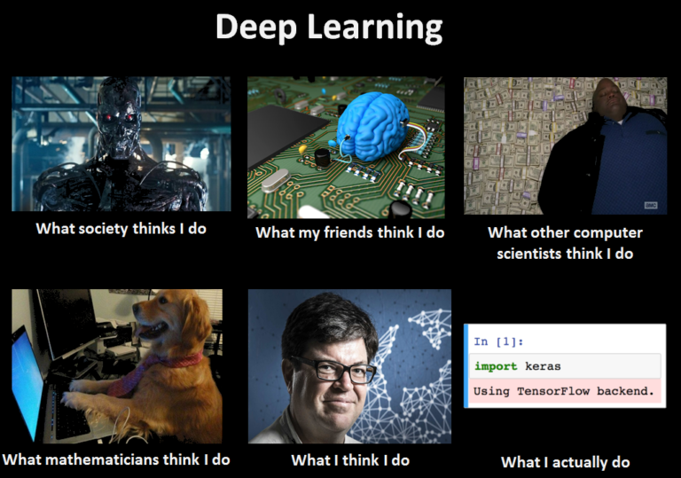
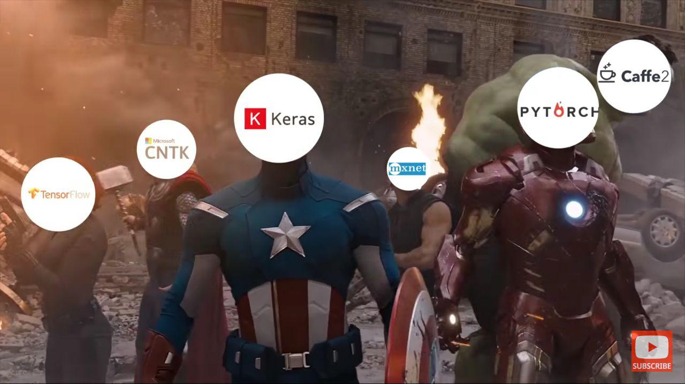

# Let's do it.. Deeeep Learning

## You have to meet them, before you start.
## The DL Gangsters.

## TensorFlow [[Docs](https://www.tensorflow.org/)]

TensorFlow is a free and open-source software library for dataflow and differentiable programming across a range of tasks. 
It is a symbolic math library, and is also used for machine learning applications such as neural networks. 

## PyTorch [[Docs](https://pytorch.org/docs/stable/index.html)]

PyTorch is software, specifically a machine learning library for the programming language Python, based on the Torch library,
used for applications such as deep learning and natural language processing.[4] It is primarily developed by 
Facebook's artificial-intelligence research group, and Uber's Pyro probabilistic programming language software is built on it.
It is free and open-source software released under one of the BSD licenses.

## Keras [[Docs](https://keras.io/) [tf.keras Docs](https://www.tensorflow.org/beta/guide/keras/overview)]

Keras is an open-source neural-network library written in Python. It is capable of running on top of TensorFlow, 
Microsoft Cognitive Toolkit, Theano, or PlaidML. Designed to enable fast experimentation with deep neural networks, 
it focuses on being user-friendly, modular, and extensible. 

[Understand Keras](https://machinelearningmastery.com/tutorial-first-neural-network-python-keras/)

[Learn Keras](https://colab.research.google.com/github/tensorflow/docs/blob/master/site/en/guide/keras.ipynb)

## The Real Superpower is....

## MNIST, respect traditions..
 
[MNIST Keras](https://colab.research.google.com/github/GokulDas027/ML-Codes/blob/master/MNIST-Keras.ipynb)

## Fashion MNIST

[Fashion MNIST Keras](https://colab.research.google.com/github/tensorflow/docs/blob/master/site/en/tutorials/keras/basic_classification.ipynb)
 
## IMDB Sentiment Analysis
 
[Sentiment Analysis Keras](https://colab.research.google.com/github/GokulDas027/ML-Codes/blob/master/sentement_analysis_keras.ipynb)

## CIFAR-10

[CIFAR 10 Keras](https://colab.research.google.com/drive/1Xo3UCk63vDEV-kQ3esAKoQIUGqW-F-Fv)

## Cat Dog Classifier

[Cat Dog Classifer on Keras](https://colab.research.google.com/github/GokulDas027/ML-Codes/blob/master/cat%20or%20dog%20classifier%20KERAS.ipynb)
 
 
## Neural Network Overfitting/Underfitting and Counter Measures.
[Test Case Notebook](https://colab.research.google.com/github/tensorflow/docs/blob/master/site/en/tutorials/keras/overfit_and_underfit.ipynb)

 
