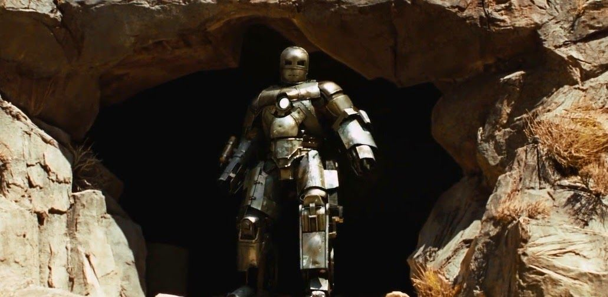

# Let's  see something even more awesome..

## Generative Advarsarial Networks

> in short : Generative Advarsarial Networks, GANs are a type of Neural Network Architecture that could generate real like data.

GANs were introduced in 2014, by Ian Goodfellow and other researchers at the University of Montreal, including Yoshua Bengio in their paper Generative Adversarial Nets. GAN is just an awesome idea, in which we simultaneously train two models, One aganist the other!! One of the models is called the Generator, the creator who 'generates' data and the other is called the Discriminator, who is trained to be an expert in distinguishing the real data from the fake. The whole story is about the Generator getting better and eventually generating real like data, thereby fooling the Discriminator by showing Fake(Generated) data and getting it certified as Real.

[Different Variants of GAN](https://github.com/GokulDas027/Generative-Adversarial-Networks-GANs)

## Style Transfer

> Generating a third image from two distinct images, such that, the new image contains the features on one image and the style of other image.

## Closing Note..

### yeah it seems like, but not exactly.. and...

## Go break some eggs..
I meant, data..

