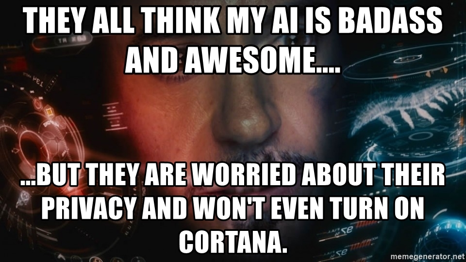

# MAP to the Deep Learning world.

## Links to Resource Pointers.

1. [Machine-Learning-Tutorials](https://github.com/ujjwalkarn/Machine-Learning-Tutorials)

2. [Awesome Deep Learning](https://github.com/ChristosChristofidis/awesome-deep-learning)

## Courses

* Udacity
* Coursera
* YouTube/SirajRaval
* YouTube/Sentdex

## Review about best papers:

* [YouTube/Two Minute Papers](https://www.youtube.com/user/keeroyz/)
   nb: this channel will keep you addicted to ML.

## For Papers

* [ArXiv](http://arxiv.org/)
* [ArXiv Sanity (it's nicer!)](http://www.arxiv-sanity.com/)

## For Data

That's their right. Me too cares about privacy.

* Kaggle
* Google Dataset Search
* GitHub
* (google knows more, just ask)

if you've been through all those.., head on to [here](https://www.khanacademy.org/) or [here](https://www.youtube.com/3blue1brown) because you're in..

